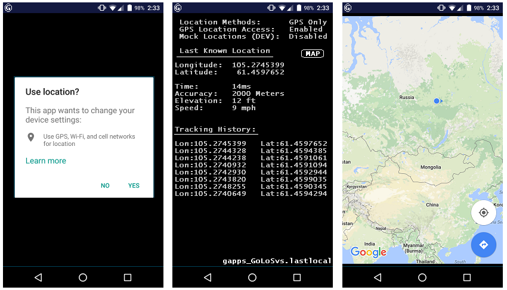

# Last Known Location
(Android Dalvik) APK using mGoogle Api to read LastLocation from GPS co-ordinates 

```
// https://github.com/XC3pti0n/gapps_GoLoSvs.lastlocal 
/*
 *
 *    Licensed under the Apache License, Version 2.0 (the "License");
 *    you may not use this file except in compliance with the License.
 *    You may obtain a copy of the License at:
 *
 *    http://www.apache.org/licenses/LICENSE-2.0
 *
 *    Unless required by applicable law or agreed to in writing, software
 *    distributed under the License is distributed on an "AS IS" BASIS,
 *    WITHOUT WARRANTIES OR CONDITIONS OF ANY KIND, either express or implied.
 *    See the License for the specific language governing permissions and
 *    limitations under the License.
 */
```

## gapps_GoLoSvs.lastlocal
Building a location-aware application on Android. This project provides the API for Google Play Sercvice 9.2.1, it is a simple utility class that requests historical GPS inforamtion. TODO: mock location awareness.

__Supported API level:__ 21+ (Android 5.1.1 and above) for newer devices.


## Why
I struggled with Android's location issues for several days until I had what felt like an acceptable solution. In this repository I am making available the relevant source code. 

## Usage
This application requires Android.permission.ACCESS_COARSE_LOCATION so it's reliability is roughly a city block. The next APK will have ACCESS_FINE_LOCATION and ACCESS_MOCK_LOCATION to ensure location accuracy.

1. Add this line to your `AndroidManifest.xml`, right after the opening `<manifest>`
tag:
    ``` xml
     <uses-permission android:name="android.permission.ACCESS_COARSE_LOCATION" />
    ```

1. In your app's `build.gradle` file, add the following line to your `dependencies` :
    ``` groovy
        compile 'com.google.android.gms:play-services-location:9.2.1'
    ```


## Contact & Contribute
```
This is a small project. If you like it, you can drop me a comment. If you spot an error or want to suggest an improvement, feel free to submit a PR or contact me via xce[at]eliteroot.com
```

### Screen Shots


